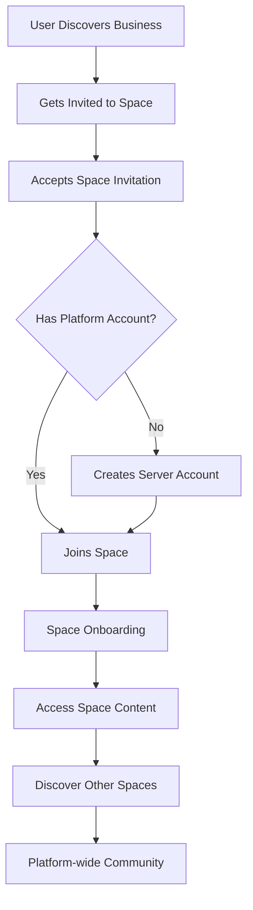

# Business & Creator Collaboration Platform Architecture
## "Locals for Every Business" - Multi-Platform Integration & Content Hosting

## 🎯 Vision Statement

Building the ultimate business and creator collaboration platform that enables:
- **Space-based communities** for every business/brand
- **Multi-platform content integration** (YouTube, TikTok, Instagram, etc.)
- **Direct content hosting** and monetization
- **Seamless member onboarding** from spaces to the broader server
- **Enterprise-grade collaboration** with Discord-like real-time features

## 🏗 Core Architecture Overview

### **1. Three-Tier Membership Model**

```typescript
// Platform Hierarchy
Server (Global Platform)
├── Spaces (Business/Creator Communities)
│   ├── Channels (Content & Discussion)
│   ├── Members (Community Members)
│   └── Content (Hosted & Integrated)
└── Users (Platform-wide Accounts)
```

### **2. Member Journey Flow**



## 📊 Enhanced Collections Architecture

### **1. Enhanced Spaces Collection (Business/Creator Hub)**

```typescript
// src/collections/Spaces.ts
import { CollectionConfig } from 'payload'

const Spaces: CollectionConfig = {
  slug: 'spaces',
  admin: {
    group: 'Platform',
    useAsTitle: 'businessName',
    defaultColumns: ['businessName', 'businessType', 'owner', 'memberCount', 'contentCount'],
    description: 'Business and creator community spaces',
  },
  fields: [
    // Business Identity
    {
      name: 'businessName',
      type: 'text',
      required: true,
      admin: {
        description: 'Business or creator brand name',
      },
    },
    {
      name: 'businessType',
      type: 'select',
      options: [
        { label: 'Content Creator', value: 'creator' },
        { label: 'Small Business', value: 'small_business' },
        { label: 'Enterprise', value: 'enterprise' },
        { label: 'Non-Profit', value: 'non_profit' },
        { label: 'Educational', value: 'educational' },
        { label: 'Community Group', value: 'community' },
        { label: 'Professional Services', value: 'professional' },
        { label: 'E-commerce', value: 'ecommerce' },
      ],
      required: true,
      admin: {
        description: 'Type of business or organization',
      },
    },
    {
      name: 'description',
      type: 'richText',
      admin: {
        description: 'Business description and value proposition',
      },
    },
    {
      name: 'industry',
      type: 'select',
      options: [
        { label: 'Technology', value: 'technology' },
        { label: 'Entertainment', value: 'entertainment' },
        { label: 'Education', value: 'education' },
        { label: 'Health & Wellness', value: 'health' },
        { label: 'Finance', value: 'finance' },
        { label: 'Retail', value: 'retail' },
        { label: 'Food & Beverage', value: 'food' },
        { label: 'Travel', value: 'travel' },
        { label: 'Gaming', value: 'gaming' },
        { label: 'Fitness', value: 'fitness' },
        { label: 'Art & Design', value: 'art' },
        { label: 'Music', value: 'music' },
        { label: 'Other', value: 'other' },
      ],
      admin: {
        description: 'Business industry category',
      },
    },

    // Platform Integrations
    {
      name: 'platformIntegrations',
      type: 'group',
      label: 'Platform Integrations',
      fields: [
        {
          name: 'youtube',
          type: 'group',
          fields: [
            {
              name: 'channelId',
              type: 'text',
              admin: { description: 'YouTube Channel ID' },
            },
            {
              name: 'channelHandle',
              type: 'text',
              admin: { description: 'YouTube @handle' },
            },
            {
              name: 'apiKey',
              type: 'text',
              admin: { description: 'YouTube API Key (encrypted)' },
            },
            {
              name: 'syncEnabled',
              type: 'checkbox',
              defaultValue: false,
              admin: { description: 'Auto-sync new videos' },
            },
          ],
        },
        {
          name: 'instagram',
          type: 'group',
          fields: [
            {
              name: 'username',
              type: 'text',
              admin: { description: 'Instagram username' },
            },
            {
              name: 'accessToken',
              type: 'text',
              admin: { description: 'Instagram API token (encrypted)' },
            },
            {
              name: 'syncEnabled',
              type: 'checkbox',
              defaultValue: false,
            },
          ],
        },
        {
          name: 'tiktok',
          type: 'group',
          fields: [
            {
              name: 'username',
              type: 'text',
              admin: { description: 'TikTok username' },
            },
            {
              name: 'accessToken',
              type: 'text',
              admin: { description: 'TikTok API token (encrypted)' },
            },
            {
              name: 'syncEnabled',
              type: 'checkbox',
              defaultValue: false,
            },
          ],
        },
        {
          name: 'twitter',
          type: 'group',
          fields: [
            {
              name: 'handle',
              type: 'text',
              admin: { description: 'Twitter/X handle' },
            },
            {
              name: 'accessToken',
              type: 'text',
              admin: { description: 'Twitter API token (encrypted)' },
            },
            {
              name: 'syncEnabled',
              type: 'checkbox',
              defaultValue: false,
            },
          ],
        },
        {
          name: 'linkedin',
          type: 'group',
          fields: [
            {
              name: 'companyId',
              type: 'text',
              admin: { description: 'LinkedIn Company/Personal ID' },
            },
            {
              name: 'accessToken',
              type: 'text',
              admin: { description: 'LinkedIn API token (encrypted)' },
            },
            {
              name: 'syncEnabled',
              type: 'checkbox',
              defaultValue: false,
            },
          ],
        },
        {
          name: 'website',
          type: 'group',
          fields: [
            {
              name: 'url',
              type: 'url',
              admin: { description: 'Primary website URL' },
            },
            {
              name: 'rssFeeds',
              type: 'array',
              fields: [
                {
                  name: 'url',
                  type: 'url',
                  required: true,
                },
                {
                  name: 'title',
                  type: 'text',
                  required: true,
                },
              ],
              admin: { description: 'RSS feeds to sync content from' },
            },
          ],
        },
      ],
      admin: {
        description: 'External platform integrations for content sync',
      },
    },

    // Content & Monetization
    {
      name: 'contentSettings',
      type: 'group',
      label: 'Content & Monetization',
      fields: [
        {
          name: 'hostContent',
          type: 'checkbox',
          defaultValue: true,
          admin: {
            description: 'Allow hosting content directly on platform',
          },
        },
        {
          name: 'contentTypes',
          type: 'select',
          hasMany: true,
          options: [
            { label: 'Videos', value: 'videos' },
            { label: 'Podcasts', value: 'podcasts' },
            { label: 'Articles/Blogs', value: 'articles' },
            { label: 'Images/Photos', value: 'images' },
            { label: 'Documents', value: 'documents' },
            { label: 'Live Streams', value: 'livestreams' },
            { label: 'Courses', value: 'courses' },
            { label: 'Events', value: 'events' },
          ],
          admin: {
            description: 'Types of content this business creates',
          },
        },
        {
          name: 'monetization',
          type: 'group',
          fields: [
            {
              name: 'enabled',
              type: 'checkbox',
              defaultValue: false,
              admin: { description: 'Enable monetization features' },
            },
            {
              name: 'subscriptionTiers',
              type: 'array',
              fields: [
                {
                  name: 'name',
                  type: 'text',
                  required: true,
                  admin: { description: 'Tier name (e.g., "Basic", "Premium")' },
                },
                {
                  name: 'price',
                  type: 'number',
                  required: true,
                  admin: { description: 'Monthly price in cents' },
                },
                {
                  name: 'benefits',
                  type: 'array',
                  fields: [
                    {
                      name: 'benefit',
                      type: 'text',
                      required: true,
                    },
                  ],
                },
                {
                  name: 'channelAccess',
                  type: 'relationship',
                  relationTo: 'channels',
                  hasMany: true,
                  admin: { description: 'Channels accessible to this tier' },
                },
              ],
              admin: {
                condition: (data) => data?.monetization?.enabled === true,
              },
            },
            {
              name: 'stripeAccountId',
              type: 'text',
              admin: {
                description: 'Stripe Connect account ID',
                condition: (data) => data?.monetization?.enabled === true,
              },
            },
          ],
        },
      ],
    },

    // Community Settings
    {
      name: 'communitySettings',
      type: 'group',
      label: 'Community Settings',
      fields: [
        {
          name: 'isPublic',
          type: 'checkbox',
          defaultValue: true,
          admin: {
            description: 'Space appears in public directory',
          },
        },
        {
          name: 'requireApproval',
          type: 'checkbox',
          defaultValue: false,
          admin: {
            description: 'New members require approval to join',
          },
        },
        {
          name: 'allowSelfJoin',
          type: 'checkbox',
          defaultValue: true,
          admin: {
            description: 'Users can join without invitation',
          },
        },
        {
          name: 'maxMembers',
          type: 'number',
          defaultValue: 1000,
          admin: {
            description: 'Maximum number of members (0 = unlimited)',
          },
        },
        {
          name: 'welcomeMessage',
          type: 'richText',
          admin: {
            description: 'Message shown to new members',
          },
        },
        {
          name: 'rules',
          type: 'array',
          fields: [
            {
              name: 'rule',
              type: 'text',
              required: true,
            },
          ],
          admin: {
            description: 'Community rules and guidelines',
          },
        },
      ],
    },

    // Analytics & Insights
    {
      name: 'analytics',
      type: 'group',
      label: 'Analytics & Insights',
      fields: [
        {
          name: 'trackEngagement',
          type: 'checkbox',
          defaultValue: true,
          admin: {
            description: 'Track member engagement metrics',
          },
        },
        {
          name: 'trackContentPerformance',
          type: 'checkbox',
          defaultValue: true,
          admin: {
            description: 'Track content performance across platforms',
          },
        },
        {
          name: 'aiInsights',
          type: 'checkbox',
          defaultValue: true,
          admin: {
            description: 'Enable AI-powered business insights',
          },
        },
      ],
    },

    // Existing fields...
    {
      name: 'owner',
      type: 'relationship',
      relationTo: 'users',
      required: true,
      admin: {
        description: 'Business owner/primary administrator',
      },
    },
    {
      name: 'members',
      type: 'relationship',
      relationTo: 'members',
      hasMany: true,
      admin: {
        description: 'Space members',
      },
    },
    {
      name: 'channels',
      type: 'relationship',
      relationTo: 'channels',
      hasMany: true,
      admin: {
        description: 'Communication channels',
      },
    },
  ],

  hooks: {
    afterChange: [
      async ({ doc, operation, req: { payload } }) => {
        if (operation === 'create') {
          // Auto-create default channels for new business spaces
          const defaultChannels = [
            {
              name: 'general',
              type: 'text',
              description: 'General discussion and announcements',
              isDefault: true,
            },
            {
              name: 'content-updates',
              type: 'text',
              description: 'New content notifications and updates',
              isDefault: false,
            },
            {
              name: 'community',
              type: 'text',
              description: 'Community discussions and member interactions',
              isDefault: false,
            },
          ]

          // Add business-specific channels based on type
          if (doc.businessType === 'creator') {
            defaultChannels.push({
              name: 'behind-the-scenes',
              type: 'text',
              description: 'Exclusive behind-the-scenes content',
              isDefault: false,
            })
          }

          if (doc.contentSettings?.contentTypes?.includes('videos')) {
            defaultChannels.push({
              name: 'video-discussions',
              type: 'text',
              description: 'Discuss videos and provide feedback',
              isDefault: false,
            })
          }

          // Create channels
          for (const channelData of defaultChannels) {
            await payload.create({
              collection: 'channels',
              data: {
                ...channelData,
                space: doc.id,
              },
            })
          }

          // Create owner membership
          await payload.create({
            collection: 'members',
            data: {
              user: doc.owner,
              space: doc.id,
              spaceRole: 'space_owner',
              status: 'active',
              joinedAt: new Date(),
            },
          })

          // Initialize platform integrations if enabled
          if (doc.platformIntegrations) {
            await initializePlatformSync(doc.id, doc.platformIntegrations)
          }
        }
      },
    ],
  },
}

export default Spaces
```

### **2. Enhanced Members Collection (Space → Server Onboarding)**

```typescript
// src/collections/Members.ts - Enhanced for platform onboarding
const Members: CollectionConfig = {
  slug: 'members',
  admin: {
    group: 'Platform',
    useAsTitle: 'displayName',
    defaultColumns: ['displayName', 'user', 'space', 'membershipType', 'status'],
  },
  fields: [
    // Core relationships
    {
      name: 'user',
      type: 'relationship',
      relationTo: 'users',
      required: true,
      admin: {
        description: 'Platform user account',
      },
    },
    {
      name: 'space',
      type: 'relationship',
      relationTo: 'spaces',
      required: true,
      admin: {
        description: 'Business space membership',
      },
    },

    // Membership Context
    {
      name: 'membershipType',
      type: 'select',
      options: [
        { label: 'Customer', value: 'customer' },
        { label: 'Subscriber', value: 'subscriber' },
        { label: 'Community Member', value: 'community' },
        { label: 'Employee', value: 'employee' },
        { label: 'Partner', value: 'partner' },
        { label: 'Investor', value: 'investor' },
        { label: 'Collaborator', value: 'collaborator' },
        { label: 'Fan/Follower', value: 'fan' },
      ],
      defaultValue: 'community',
      admin: {
        description: 'Type of relationship with the business',
      },
    },
    {
      name: 'subscriptionTier',
      type: 'relationship',
      relationTo: 'subscription-tiers',
      admin: {
        description: 'Paid subscription tier (if applicable)',
      },
    },

    // Onboarding Journey
    {
      name: 'onboardingStatus',
      type: 'select',
      options: [
        { label: 'Invited', value: 'invited' },
        { label: 'Space Joined', value: 'space_joined' },
        { label: 'Server Onboarded', value: 'server_onboarded' },
        { label: 'Fully Active', value: 'fully_active' },
      ],
      defaultValue: 'invited',
      admin: {
        description: 'Member onboarding progress',
      },
    },
    {
      name: 'onboardingSteps',
      type: 'group',
      fields: [
        {
          name: 'spaceWelcomeShown',
          type: 'checkbox',
          defaultValue: false,
        },
        {
          name: 'platformTourCompleted',
          type: 'checkbox',
          defaultValue: false,
        },
        {
          name: 'profileCompleted',
          type: 'checkbox',
          defaultValue: false,
        },
        {
          name: 'firstInteraction',
          type: 'checkbox',
          defaultValue: false,
        },
        {
          name: 'otherSpacesDiscovered',
          type: 'checkbox',
          defaultValue: false,
        },
      ],
      admin: {
        description: 'Onboarding milestone tracking',
      },
    },

    // Engagement Tracking
    {
      name: 'engagementMetrics',
      type: 'group',
      fields: [
        {
          name: 'lastActive',
          type: 'date',
          admin: {
            description: 'Last activity in this space',
          },
        },
        {
          name: 'messagesCount',
          type: 'number',
          defaultValue: 0,
          admin: {
            description: 'Total messages sent in space',
          },
        },
        {
          name: 'contentInteractions',
          type: 'number',
          defaultValue: 0,
          admin: {
            description: 'Likes, comments, shares on space content',
          },
        },
        {
          name: 'referrals',
          type: 'number',
          defaultValue: 0,
          admin: {
            description: 'Members referred to this space',
          },
        },
      ],
    },

    // Platform Discovery
    {
      name: 'platformActivity',
      type: 'group',
      fields: [
        {
          name: 'otherSpaces',
          type: 'relationship',
          relationTo: 'spaces',
          hasMany: true,
          admin: {
            description: 'Other spaces this member has joined',
          },
        },
        {
          name: 'interests',
          type: 'select',
          hasMany: true,
          options: [
            { label: 'Technology', value: 'technology' },
            { label: 'Business', value: 'business' },
            { label: 'Creative', value: 'creative' },
            { label: 'Education', value: 'education' },
            { label: 'Entertainment', value: 'entertainment' },
            { label: 'Health', value: 'health' },
            { label: 'Finance', value: 'finance' },
            { label: 'Gaming', value: 'gaming' },
            { label: 'Music', value: 'music' },
            { label: 'Sports', value: 'sports' },
          ],
          admin: {
            description: 'Member interests for space recommendations',
          },
        },
        {
          name: 'recommendedSpaces',
          type: 'relationship',
          relationTo: 'spaces',
          hasMany: true,
          admin: {
            description: 'AI-recommended spaces based on activity',
          },
        },
      ],
    },

    // Existing role and permission fields...
    {
      name: 'spaceRole',
      type: 'select',
      options: [
        { label: 'Space Owner', value: 'space_owner' },
        { label: 'Space Admin', value: 'space_admin' },
        { label: 'Space Moderator', value: 'space_moderator' },
        { label: 'Space Member', value: 'space_member' },
        { label: 'Space Client', value: 'space_client' },
        { label: 'Space Guest', value: 'space_guest' },
      ],
      defaultValue: 'space_member',
    },
  ],

  hooks: {
    afterChange: [
      async ({ doc, operation, req: { payload } }) => {
        if (operation === 'create' && doc.status === 'active') {
          // Trigger onboarding sequence
          await triggerMemberOnboarding(doc.id, payload)

          // Update space member count
          await updateSpaceMemberCount(doc.space, payload)

          // Generate space recommendations
          await generateSpaceRecommendations(doc.user, doc.interests, payload)
        }
      },
    ],
  },
}
```

### **3. Content Integration Collection**

```typescript
// src/collections/ContentIntegrations.ts
const ContentIntegrations: CollectionConfig = {
  slug: 'content-integrations',
  admin: {
    group: 'Content',
    useAsTitle: 'title',
    description: 'Integrated content from external platforms',
  },
  fields: [
    {
      name: 'space',
      type: 'relationship',
      relationTo: 'spaces',
      required: true,
      admin: {
        description: 'Space this content belongs to',
      },
    },
    {
      name: 'platform',
      type: 'select',
      options: [
        { label: 'YouTube', value: 'youtube' },
        { label: 'Instagram', value: 'instagram' },
        { label: 'TikTok', value: 'tiktok' },
        { label: 'Twitter/X', value: 'twitter' },
        { label: 'LinkedIn', value: 'linkedin' },
        { label: 'RSS Feed', value: 'rss' },
        { label: 'Direct Upload', value: 'direct' },
      ],
      required: true,
    },
    {
      name: 'externalId',
      type: 'text',
      admin: {
        description: 'Original platform content ID',
      },
    },
    {
      name: 'title',
      type: 'text',
      required: true,
    },
    {
      name: 'description',
      type: 'textarea',
    },
    {
      name: 'contentType',
      type: 'select',
      options: [
        { label: 'Video', value: 'video' },
        { label: 'Image', value: 'image' },
        { label: 'Article', value: 'article' },
        { label: 'Podcast', value: 'podcast' },
        { label: 'Live Stream', value: 'livestream' },
        { label: 'Short Form', value: 'short' },
      ],
      required: true,
    },
    {
      name: 'media',
      type: 'relationship',
      relationTo: 'media',
      admin: {
        description: 'Local media file (if hosted)',
      },
    },
    {
      name: 'externalUrl',
      type: 'url',
      admin: {
        description: 'Original platform URL',
      },
    },
    {
      name: 'embedCode',
      type: 'textarea',
      admin: {
        description: 'Embed code for external content',
      },
    },
    {
      name: 'metadata',
      type: 'json',
      admin: {
        description: 'Platform-specific metadata',
      },
    },
    {
      name: 'syncStatus',
      type: 'select',
      options: [
        { label: 'Synced', value: 'synced' },
        { label: 'Pending', value: 'pending' },
        { label: 'Failed', value: 'failed' },
        { label: 'Manual', value: 'manual' },
      ],
      defaultValue: 'pending',
    },
    {
      name: 'publishedAt',
      type: 'date',
      admin: {
        description: 'Original publication date',
      },
    },
    {
      name: 'performance',
      type: 'group',
      fields: [
        {
          name: 'views',
          type: 'number',
          defaultValue: 0,
        },
        {
          name: 'likes',
          type: 'number',
          defaultValue: 0,
        },
        {
          name: 'shares',
          type: 'number',
          defaultValue: 0,
        },
        {
          name: 'comments',
          type: 'number',
          defaultValue: 0,
        },
        {
          name: 'engagement',
          type: 'number',
          defaultValue: 0,
          admin: {
            description: 'Engagement rate percentage',
          },
        },
      ],
    },
  ],
}
```

## 🔄 Platform Integration Services

### **1. Content Sync Service**

```typescript
// src/services/ContentSyncService.ts
export class ContentSyncService {
  private platforms = {
    youtube: new YouTubeSync(),
    instagram: new InstagramSync(),
    tiktok: new TikTokSync(),
    twitter: new TwitterSync(),
    linkedin: new LinkedInSync(),
    rss: new RSSSync(),
  }

  async syncSpaceContent(spaceId: string) {
    const space = await payload.findByID({
      collection: 'spaces',
      id: spaceId,
      depth: 1,
    })

    const integrations = space.platformIntegrations
    const syncPromises = []

    // Sync each enabled platform
    Object.entries(integrations).forEach(([platform, config]) => {
      if (config.syncEnabled && this.platforms[platform]) {
        syncPromises.push(
          this.platforms[platform].syncContent(spaceId, config)
        )
      }
    })

    const results = await Promise.allSettled(syncPromises)

    // Log sync results
    await this.logSyncResults(spaceId, results)

    return results
  }

  async syncAllSpaces() {
    const spaces = await payload.find({
      collection: 'spaces',
      where: {
        'platformIntegrations.*.syncEnabled': {
          equals: true,
        },
      },
    })

    const syncPromises = spaces.docs.map(space =>
      this.syncSpaceContent(space.id)
    )

    return Promise.allSettled(syncPromises)
  }
}

class YouTubeSync {
  async syncContent(spaceId: string, config: any) {
    const youtube = google.youtube({
      version: 'v3',
      auth: config.apiKey,
    })

    // Get recent videos
    const response = await youtube.search.list({
      part: ['snippet'],
      channelId: config.channelId,
      order: 'date',
      maxResults: 10,
      publishedAfter: this.getLastSyncDate(spaceId),
    })

    // Create content integration records
    const contentPromises = response.data.items.map(async (video) => {
      return payload.create({
        collection: 'content-integrations',
        data: {
          space: spaceId,
          platform: 'youtube',
          externalId: video.id.videoId,
          title: video.snippet.title,
          description: video.snippet.description,
          contentType: 'video',
          externalUrl: `https://youtube.com/watch?v=${video.id.videoId}`,
          embedCode: `<iframe src="https://youtube.com/embed/${video.id.videoId}"></iframe>`,
          publishedAt: video.snippet.publishedAt,
          metadata: {
            channelTitle: video.snippet.channelTitle,
            thumbnails: video.snippet.thumbnails,
          },
          syncStatus: 'synced',
        },
      })
    })

    return Promise.all(contentPromises)
  }
}
```

### **2. Member Onboarding Service**

```typescript
// src/services/OnboardingService.ts
export class OnboardingService {
  async triggerMemberOnboarding(memberId: string, payload: any) {
    const member = await payload.findByID({
      collection: 'members',
      id: memberId,
      depth: 2,
    })

    // Step 1: Space welcome
    await this.sendSpaceWelcome(member)

    // Step 2: Platform tour (if new user)
    if (await this.isNewPlatformUser(member.user.id)) {
      await this.initiatePlatformTour(member.user.id)
    }

    // Step 3: Generate space recommendations
    await this.generateSpaceRecommendations(member)

    // Step 4: Schedule follow-up engagement
    await this.scheduleEngagementFollowUp(member)
  }

  async sendSpaceWelcome(member: any) {
    const space = member.space
    const welcomeMessage = space.communitySettings?.welcomeMessage

    if (welcomeMessage) {
      // Send welcome message in general channel
      const generalChannel = await payload.find({
        collection: 'channels',
        where: {
          and: [
            { space: { equals: space.id } },
            { name: { equals: 'general' } },
          ],
        },
        limit: 1,
      })

      if (generalChannel.docs.length > 0) {
        await payload.create({
          collection: 'messages',
          data: {
            content: `Welcome ${member.user.name}! ${welcomeMessage}`,
            messageType: 'system',
            channel: generalChannel.docs[0].id,
            spaceMember: member.id,
          },
        })
      }
    }

    // Update onboarding status
    await payload.update({
      collection: 'members',
      id: member.id,
      data: {
        'onboardingSteps.spaceWelcomeShown': true,
      },
    })
  }

  async generateSpaceRecommendations(member: any) {
    const userInterests = member.interests || []
    const currentSpace = member.space

    // Find similar spaces based on industry and interests
    const recommendations = await payload.find({
      collection: 'spaces',
      where: {
        and: [
          { id: { not_equals: currentSpace.id } },
          { 'communitySettings.isPublic': { equals: true } },
          {
            or: [
              { industry: { equals: currentSpace.industry } },
              { 'contentSettings.contentTypes': { in: userInterests } },
            ],
          },
        ],
      },
      limit: 5,
    })

    // Update member with recommendations
    await payload.update({
      collection: 'members',
      id: member.id,
      data: {
        'platformActivity.recommendedSpaces': recommendations.docs.map(s => s.id),
      },
    })

    return recommendations.docs
  }
}
```

## 🎨 Frontend Components

### **1. Space Discovery Component**

```typescript
// src/components/SpaceDiscovery.tsx
'use client'

import { useState, useEffect } from 'react'
import { Card } from '@/components/ui/card'
import { Button } from '@/components/ui/button'
import { Badge } from '@/components/ui/badge'

interface SpaceDiscoveryProps {
  userId: string
  currentSpaceId?: string
}

export function SpaceDiscovery({ userId, currentSpaceId }: SpaceDiscoveryProps) {
  const [spaces, setSpaces] = useState([])
  const [loading, setLoading] = useState(true)
  const [filter, setFilter] = useState('all')

  useEffect(() => {
    fetchSpaces()
  }, [filter])

  const fetchSpaces = async () => {
    try {
      const response = await fetch(`/api/spaces/discover?filter=${filter}&exclude=${currentSpaceId}`)
      const data = await response.json()
      setSpaces(data.docs || [])
    } catch (error) {
      console.error('Failed to fetch spaces:', error)
    } finally {
      setLoading(false)
    }
  }

  const joinSpace = async (spaceId: string) => {
    try {
      await fetch('/api/spaces/join', {
        method: 'POST',
        headers: { 'Content-Type': 'application/json' },
        body: JSON.stringify({ spaceId }),
      })

      // Refresh spaces list
      fetchSpaces()
    } catch (error) {
      console.error('Failed to join space:', error)
    }
  }

  return (
    <div className="space-discovery">
      <div className="mb-6">
        <h2 className="text-2xl font-bold mb-4">Discover Businesses & Creators</h2>

        <div className="flex gap-2 mb-4">
          {['all', 'creator', 'small_business', 'enterprise', 'educational'].map(filterType => (
            <Button
              key={filterType}
              variant={filter === filterType ? 'default' : 'outline'}
              size="sm"
              onClick={() => setFilter(filterType)}
            >
              {filterType.replace('_', ' ').toUpperCase()}
            </Button>
          ))}
        </div>
      </div>

      <div className="grid grid-cols-1 md:grid-cols-2 lg:grid-cols-3 gap-6">
        {spaces.map((space: any) => (
          <Card key={space.id} className="p-6">
            <div className="flex items-start justify-between mb-4">
              <div className="flex items-center gap-3">
                
                <div>
                  <h3 className="font-semibold">{space.businessName}</h3>
                  <p className="text-sm text-gray-500">{space.industry}</p>
                </div>
              </div>
              <Badge variant="secondary">
                {space.businessType.replace('_', ' ')}
              </Badge>
            </div>

            <p className="text-sm text-gray-600 mb-4 line-clamp-3">
              {space.description}
            </p>

            <div className="flex items-center justify-between mb-4">
              <div className="flex gap-2">
                {space.platformIntegrations?.youtube?.channelId && (
                  <Badge variant="outline" className="text-red-600">
                    YouTube
                  </Badge>
                )}
                {space.platformIntegrations?.instagram?.username && (
                  <Badge variant="outline" className="text-pink-600">
                    Instagram
                  </Badge>
                )}
                {space.platformIntegrations?.tiktok?.username && (
                  <Badge variant="outline" className="text-black">
                    TikTok
                  </Badge>
                )}
              </div>
              <span className="text-sm text-gray-500">
                {space.memberCount} members
              </span>
            </div>

            <div className="flex gap-2">
              <Button
                size="sm"
                onClick={() => joinSpace(space.id)}
                className="flex-1"
              >
                Join Community
              </Button>
              <Button
                variant="outline"
                size="sm"
                onClick={() => window.open(`/spaces/${space.id}`, '_blank')}
              >
                Preview
              </Button>
            </div>
          </Card>
        ))}
      </div>
    </div>
  )
}
```

### **2. Content Integration Dashboard**

```typescript
// src/components/ContentDashboard.tsx
'use client'

import { useState, useEffect } from 'react'
import { Card } from '@/components/ui/card'
import { Button } from '@/components/ui/button'
import { Badge } from '@/components/ui/badge'
import { Tabs, TabsContent, TabsList, TabsTrigger } from '@/components/ui/tabs'

interface ContentDashboardProps {
  spaceId: string
}

export function ContentDashboard({ spaceId }: ContentDashboardProps) {
  const [content, setContent] = useState([])
  const [platforms, setPlatforms] = useState({})
  const [syncing, setSyncing] = useState(false)

  const syncContent = async (platform?: string) => {
    setSyncing(true)
    try {
      const endpoint = platform
        ? `/api/content/sync?space=${spaceId}&platform=${platform}`
        : `/api/content/sync?space=${spaceId}`

      await fetch(endpoint, { method: 'POST' })

      // Refresh content list
      fetchContent()
    } catch (error) {
      console.error('Sync failed:', error)
    } finally {
      setSyncing(false)
    }
  }

  const fetchContent = async () => {
    try {
      const response = await fetch(`/api/content?space=${spaceId}`)
      const data = await response.json()
      setContent(data.docs || [])
    } catch (error) {
      console.error('Failed to fetch content:', error)
    }
  }

  return (
    <div className="content-dashboard">
      <div className="flex justify-between items-center mb-6">
        <h2 className="text-2xl font-bold">Content Management</h2>
        <div className="flex gap-2">
          <Button
            onClick={() => syncContent()}
            disabled={syncing}
          >
            {syncing ? 'Syncing...' : 'Sync All Platforms'}
          </Button>
          <Button variant="outline">
            Upload Direct
          </Button>
        </div>
      </div>

      <Tabs defaultValue="all" className="w-full">
        <TabsList>
          <TabsTrigger value="all">All Content</TabsTrigger>
          <TabsTrigger value="youtube">YouTube</TabsTrigger>
          <TabsTrigger value="instagram">Instagram</TabsTrigger>
          <TabsTrigger value="tiktok">TikTok</TabsTrigger>
          <TabsTrigger value="direct">Direct Uploads</TabsTrigger>
        </TabsList>

        <TabsContent value="all" className="space-y-4">
          <div className="grid grid-cols-1 md:grid-cols-2 lg:grid-cols-3 gap-4">
            {content.map((item: any) => (
              <Card key={item.id} className="p-4">
                <div className="flex items-start justify-between mb-3">
                  <Badge variant="outline" className="mb-2">
                    {item.platform}
                  </Badge>
                  <Badge
                    variant={item.syncStatus === 'synced' ? 'default' : 'secondary'}
                  >
                    {item.syncStatus}
                  </Badge>
                </div>

                <h3 className="font-medium mb-2 line-clamp-2">
                  {item.title}
                </h3>

                <p className="text-sm text-gray-600 mb-3 line-clamp-2">
                  {item.description}
                </p>

                <div className="flex items-center justify-between text-sm text-gray-500">
                  <span>{item.contentType}</span>
                  <span>{new Date(item.publishedAt).toLocaleDateString()}</span>
                </div>

                {item.performance && (
                  <div className="mt-3 pt-3 border-t flex justify-between text-sm">
                    <span>{item.performance.views} views</span>
                    <span>{item.performance.likes} likes</span>
                    <span>{item.performance.engagement}% engagement</span>
                  </div>
                )}
              </Card>
            ))}
          </div>
        </TabsContent>
      </Tabs>
    </div>
  )
}
```

## 🚀 Implementation Roadmap

### **Phase 1: Foundation (Weeks 1-2)**
1. ✅ Enhanced Spaces collection with business context
2. ✅ Member onboarding flow implementation
3. ✅ Basic platform integration setup
4. ✅ Space discovery interface

### **Phase 2: Content Integration (Weeks 3-4)**
1. ✅ YouTube API integration
2. ✅ Instagram Basic Display API
3. ✅ Content sync service
4. ✅ Content dashboard interface

### **Phase 3: Advanced Features (Weeks 5-6)**
1. ✅ Subscription and monetization system
2. ✅ AI-powered space recommendations
3. ✅ Advanced analytics dashboard
4. ✅ Multi-platform content performance tracking

### **Phase 4: Scale & Polish (Weeks 7-8)**
1. ✅ Performance optimization
2. ✅ Mobile app considerations
3. ✅ Advanced moderation tools
4. ✅ Enterprise features

## 🎯 Key Differentiators

1. **Business-First Design**: Built specifically for businesses and creators, not just communities
2. **Platform Aggregation**: Centralize all social media and content platforms
3. **Seamless Onboarding**: Space invitation → Server onboarding → Platform discovery
4. **Content Hosting**: Direct hosting capabilities alongside platform integration
5. **Monetization Ready**: Built-in subscription and payment processing
6. **AI-Powered Insights**: Business intelligence and content performance analytics
7. **Enterprise Scalable**: Multi-tenant architecture supporting unlimited businesses

This architecture creates the "Locals for every business" platform you envision - where any business or creator can build their community, integrate their existing platforms, and grow their audience all in one place.
