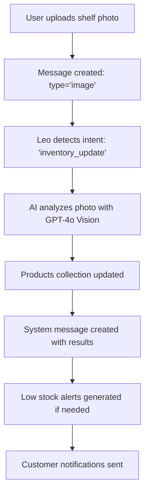

# Message-Driven Universal Event System

## Overview

The Messages collection serves as the **universal event system** for the entire platform, enabling granular filtering by context and serving as the audit trail for all business operations.

## Core Concept

**Everything flows through Messages** - from inventory updates to payment processing to AI agent decisions. This creates a searchable, filterable, and auditable record of all business activities.

## Message Types & Business Context

### Message Types
```typescript
type MessageType = 
  | 'text'                // Human conversations
  | 'image'              // Photo analysis, inventory updates
  | 'widget'             // Interactive business tools
  | 'system'             // Automated processes
  | 'ai_agent'           // Leo's autonomous decisions
  | 'voice_ai'           // VAPI voice interactions
  | 'web_chat'           // Customer support
  | 'customer_inquiry'   // Lead generation
  | 'live_handoff'       // Human takeover
  | 'system_alert'       // Critical notifications
```

### Business Context Filtering
```typescript
interface BusinessContext {
  department: 'sales' | 'marketing' | 'operations' | 'support' | 'finance'
  workflow: string  // e.g., 'inventory_management', 'customer_onboarding'
  priority: 'low' | 'normal' | 'high' | 'urgent'
  customerJourney?: 'awareness' | 'consideration' | 'purchase' | 'retention'
}
```

## Universal Building Blocks

### The Five Core Collections

1. **Posts** - Content management and syndication
2. **Pages** - Static content and landing pages  
3. **Products** - Inventory and e-commerce
4. **Messages** - Universal event system
5. **Forms** - Dynamic data collection

### How They Combine

**ANY use case** can be handled by combining these collections:

- **Blog + E-commerce**: Posts + Products + Messages (for order tracking)
- **Service Business**: Pages + Forms + Messages (for bookings)
- **SaaS Platform**: All five collections working together
- **Justice Advocacy**: Posts (awareness) + Forms (donations) + Messages (case updates)

## AI Agent Integration

### Leo's Message Processing

Leo constantly monitors the Messages collection for:

1. **Intent Detection**: Analyzing natural language for business actions
2. **Context Awareness**: Understanding conversation history and business state
3. **Autonomous Decisions**: Making independent choices based on ethical framework
4. **Cross-Reference**: Connecting messages across different workflows

### Example: Point-and-Inventory Flow



## Granular Filtering Examples

### Query by Department
```javascript
// All marketing messages for engagement analysis
const marketingMessages = await payload.find({
  collection: 'messages',
  where: {
    'businessContext.department': { equals: 'marketing' }
  }
})
```

### Query by Workflow
```javascript
// All inventory-related events for audit
const inventoryEvents = await payload.find({
  collection: 'messages',
  where: {
    'businessContext.workflow': { contains: 'inventory' }
  }
})
```

### Query by Customer Journey
```javascript
// All purchase-stage interactions for conversion optimization
const purchaseStageMessages = await payload.find({
  collection: 'messages',
  where: {
    'businessContext.customerJourney': { equals: 'purchase' }
  }
})
```

## Widget System Integration

### Interactive Blocks in Messages

The widget system enables conversational interfaces with business logic:

```typescript
interface WidgetMessage {
  messageType: 'widget'
  widgetData: {
    widgetType: 'address_verification' | 'payment_request' | 'order_form' | 'calendar_booking'
    configuration: any
    state: 'pending' | 'completed' | 'cancelled'
    results?: any
  }
}
```

### Business Workflow Examples

1. **Address Verification Widget**
   - Compliance checking for delivery restrictions
   - Automatic address validation and correction
   - Integration with shipping APIs

2. **Payment Request Widget**
   - Emergency payment collection
   - Invoice generation and tracking
   - Multi-payment method support

3. **Order Form Widget**
   - Dynamic product selection
   - Real-time inventory checking
   - Automatic pricing calculations

## Progressive JSON Metadata

Messages support **extensible metadata** for future capabilities:

```typescript
interface MessageMetadata {
  // AI Analysis
  sentiment?: 'positive' | 'neutral' | 'negative'
  confidence?: number
  topics?: string[]
  
  // Business Metrics
  revenue?: number
  customerValue?: number
  leadScore?: number
  
  // Automation
  automatedActions?: string[]
  requiresHumanReview?: boolean
  
  // Integration
  externalIds?: Record<string, string>
  syncStatus?: Record<string, 'pending' | 'synced' | 'failed'>
}
```

## AT Protocol Federation

### Cross-Platform Sync

Messages can be federated across platforms using AT Protocol:

```typescript
interface ATProtocolData {
  type: 'co.kendev.spaces.message'
  did: string  // Decentralized identifier
  uri: string  // AT Protocol URI
  cid: string  // Content identifier hash
}
```

This enables:
- **Data sovereignty**: Users own their messages
- **Platform independence**: Messages exist beyond any single platform
- **Network effects**: Messages can be discovered across federated networks

## Performance Considerations

### Efficient Querying

1. **Index Strategy**: Business context fields are indexed for fast filtering
2. **Pagination**: Large message sets are paginated for performance
3. **Caching**: Frequently accessed message patterns are cached
4. **Real-time Updates**: WebSocket connections for live message updates

### Scaling Architecture

- **Tenant Isolation**: Messages are properly scoped by tenant
- **Space Organization**: Messages are organized by spaces and channels
- **Archival Strategy**: Old messages can be archived while maintaining searchability

## Security & Privacy

### Access Control

- **Tenant-scoped**: Users can only access messages within their tenant
- **Role-based**: Different roles have different message access levels
- **Encryption**: Sensitive message content can be encrypted at rest

### Audit Trail

- **Immutable Record**: Messages provide tamper-proof audit trail
- **Compliance**: GDPR, CCPA, and other privacy regulations supported
- **Data Export**: Users can export their message data at any time

## Future Extensibility

The message-driven architecture enables future capabilities:

1. **AI Training**: Messages become training data for tenant-specific AI models
2. **Predictive Analytics**: Pattern recognition across message history
3. **Workflow Automation**: Complex multi-step processes triggered by message patterns
4. **Third-party Integration**: External systems can publish messages to the platform

## Implementation Guidelines

### Creating Messages Programmatically

```javascript
await payload.create({
  collection: 'messages',
  data: {
    content: 'Inventory updated from photo analysis',
    messageType: 'system',
    space: spaceId,
    channel: 'inventory',
    author: systemUserId,
    businessContext: {
      department: 'operations',
      workflow: 'inventory_management',
      priority: 'normal'
    },
    metadata: {
      inventoryUpdate: {
        itemsUpdated: 5,
        confidence: 0.95,
        photoUrl: 'https://...'
      }
    },
    knowledge: {
      searchable: true,
      category: 'procedure',
      tags: ['inventory', 'automation', 'photo-analysis']
    }
  }
})
```

### Best Practices

1. **Always include business context** for proper filtering
2. **Use consistent metadata schemas** within workflows  
3. **Tag messages appropriately** for knowledge management
4. **Consider performance** when creating high-volume message patterns
5. **Test filter queries** to ensure they return expected results

This message-driven architecture transforms the platform from a traditional application into a **universal business intelligence system** where every interaction becomes valuable data. 