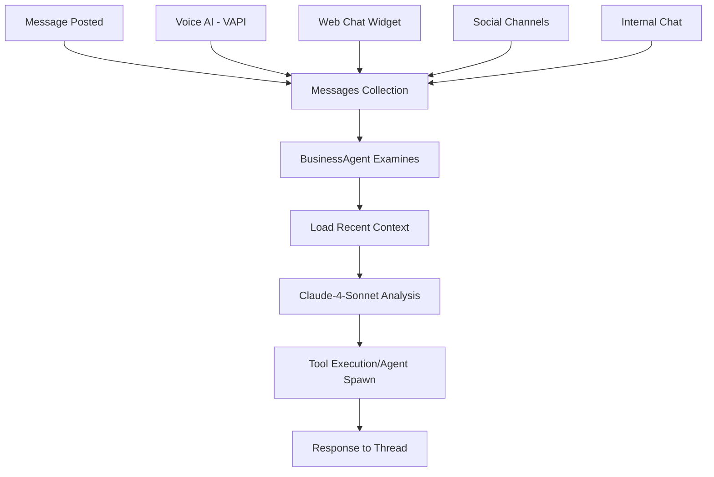

# 💬 Multi-Channel Chat System - Complete Implementation

> **Unified messaging with AI-powered BusinessAgent and Claude-4-Sonnet integration**  
> *Voice AI, Web Chat, Social Channels, and Thread Management*

## 🏗️ **System Architecture**



---

## 📊 **Messages Collection Implementation**

### **Core Message Structure** (`src/collections/Messages.ts`)
```typescript
export const Messages: CollectionConfig = {
  slug: 'messages',
  fields: [
    // Space Integration (Primary Channel)
    {
      name: 'space',
      type: 'relationship',
      relationTo: 'spaces',
      required: true
    },

    // Channel Support
    {
      name: 'channel',
      type: 'select',
      options: [
        { label: 'General', value: 'general' },
        { label: 'Voice AI', value: 'voice-ai' },
        { label: 'Web Chat', value: 'web-chat' },
        { label: 'Social Media', value: 'social' },
        { label: 'Support', value: 'support' },
        { label: 'Sales', value: 'sales' }
      ]
    },

    // Message Types
    {
      name: 'messageType',
      type: 'select',
      options: [
        { label: 'Text', value: 'text' },
        { label: 'AI Agent', value: 'ai_agent' },
        { label: 'Web Chat', value: 'web_chat' },
        { label: 'Voice AI', value: 'voice_ai' },
        { label: 'Customer Inquiry', value: 'customer_inquiry' },
        { label: 'System Alert', value: 'system_alert' }
      ]
    },

    // Threading Support
    {
      name: 'parentMessage',
      type: 'relationship',
      relationTo: 'messages'
    },
    {
      name: 'threadReplies',
      type: 'relationship',
      relationTo: 'messages',
      hasMany: true
    },

    // Business Context
    {
      name: 'businessContext',
      type: 'group',
      fields: [
        {
          name: 'department',
          type: 'select',
          options: [
            { label: 'Sales', value: 'sales' },
            { label: 'Support', value: 'support' },
            { label: 'Operations', value: 'operations' }
          ]
        },
        {
          name: 'priority',
          type: 'select',
          options: [
            { label: 'Low', value: 'low' },
            { label: 'Normal', value: 'normal' },
            { label: 'High', value: 'high' },
            { label: 'Urgent', value: 'urgent' }
          ]
        },
        {
          name: 'customerJourney',
          type: 'select',
          options: [
            { label: 'Discovery', value: 'discovery' },
            { label: 'Consideration', value: 'consideration' },
            { label: 'Purchase Intent', value: 'purchase_intent' },
            { label: 'Active Customer', value: 'active_customer' }
          ]
        }
      ]
    },

    // AI Agent Analysis
    {
      name: 'aiAgent',
      type: 'group',
      fields: [
        {
          name: 'ceoAnalysis',
          type: 'json',
          admin: { description: 'BusinessAgent analysis results' }
        },
        {
          name: 'suggestedActions',
          type: 'textarea',
          admin: { description: 'AI-suggested follow-up actions' }
        }
      ]
    }
  ]
}
```

---

## 🤖 **BusinessAgent Workflow Implementation**

### **Message Processing Flow** (`src/services/BusinessAgent.ts`)
```typescript
export class BusinessAgent {
  private tenantId: string
  private personality: 'friendly' | 'professional' | 'analytical'
  private anthropic: Anthropic

  constructor(tenantId: string, personality: string = 'professional') {
    this.tenantId = tenantId
    this.personality = personality
    this.anthropic = new Anthropic({
      apiKey: process.env.ANTHROPIC_API_KEY
    })
  }

  // 1. EXAMINE MESSAGE - Analyze intent and context
  async analyzeMessage(message: Message): Promise<MessageAnalysis> {
    const content = message.content?.toLowerCase() || ''
    
    // Intent Detection
    let intent: 'customer_inquiry' | 'sales_opportunity' | 'complaint' | 'general' = 'general'
    
    if (content.includes('product') || content.includes('catalog')) {
      intent = 'sales_opportunity'
    } else if (content.includes('problem') || content.includes('issue')) {
      intent = 'complaint'
    } else if (content.includes('help') || content.includes('question')) {
      intent = 'customer_inquiry'
    }

    // Sentiment Analysis
    const positiveWords = ['great', 'excellent', 'love', 'amazing']
    const negativeWords = ['terrible', 'awful', 'hate', 'horrible']
    
    let sentiment: 'positive' | 'negative' | 'neutral' = 'neutral'
    if (positiveWords.some(word => content.includes(word))) {
      sentiment = 'positive'
    } else if (negativeWords.some(word => content.includes(word))) {
      sentiment = 'negative'
    }

    return {
      intent,
      sentiment,
      priority: sentiment === 'negative' ? 'high' : 'normal',
      suggestedActions: this.generateSuggestedActions(intent, sentiment)
    }
  }

  // 2. LOAD RECENT CONTEXT - Get recent messages from channel
  async loadRecentContext(spaceId: string, channel: string, limit: number = 10): Promise<Message[]> {
    const payload = await getPayload({ config: configPromise })
    
    const recentMessages = await payload.find({
      collection: 'messages',
      where: {
        and: [
          { space: { equals: spaceId } },
          { channel: { equals: channel } }
        ]
      },
      sort: '-createdAt',
      limit
    })

    return recentMessages.docs
  }

  // 3. CLAUDE-4-SONNET ANALYSIS - Generate intelligent response
  async generateIntelligentResponse(
    message: string,
    context?: { 
      customerName?: string
      previousMessages?: string[]
      urgency?: string 
    }
  ): Promise<string> {
    const payload = await getPayload({ config: configPromise })
    const tenant = await payload.findByID({
      collection: 'tenants',
      id: this.tenantId
    })

    const businessType = tenant?.businessType || 'general business'
    const businessName = tenant?.name || 'Business'
    
    // Build conversation context
    const conversationContext = context?.previousMessages?.length 
      ? `\n\nPrevious conversation:\n${context.previousMessages.join('\n')}`
      : ''

    const response = await this.anthropic.messages.create({
      model: 'claude-3-5-sonnet-20241022',
      max_tokens: 400,
      temperature: 0.4,
      messages: [{
        role: 'user',
        content: `You are the AI assistant for ${businessName}, a ${businessType}.

Business Personality: ${this.personality}
Customer Message: "${message}"${conversationContext}

Generate a helpful, ${this.personality} response that:
- Addresses specific questions or concerns
- Suggests relevant products/services when appropriate  
- Includes next steps or call-to-action
- Matches the ${businessType} industry tone

Response:`
      }]
    })

    return response.content[0]?.type === 'text' 
      ? response.content[0].text.trim()
      : 'Thank you for your message. We will get back to you soon.'
  }

  // 4. PROCESS MESSAGE - Main workflow entry point
  async processMessage(message: Message): Promise<MessageAnalysis> {
    try {
      // Step 1: Analyze the message
      const analysis = await this.analyzeMessage(message)
      
      // Step 2: Load recent context if needed
      const recentContext = await this.loadRecentContext(
        message.space as string, 
        message.channel || 'general'
      )
      
      // Step 3: Generate response if appropriate
      if (analysis.intent !== 'general' && analysis.priority !== 'low') {
        await this.createResponseMessage(message, analysis, recentContext)
      }

      return analysis
    } catch (error) {
      console.error(`BusinessAgent processing failed:`, error)
      return {
        intent: 'general',
        sentiment: 'neutral', 
        priority: 'normal',
        suggestedActions: ['Review message manually']
      }
    }
  }

  // 5. CREATE RESPONSE - Generate and post AI response
  private async createResponseMessage(
    originalMessage: Message, 
    analysis: MessageAnalysis,
    context: Message[]
  ): Promise<void> {
    const payload = await getPayload({ config: configPromise })
    
    // Extract previous messages for context
    const previousMessages = context
      .slice(0, 5) // Last 5 messages
      .map(msg => `${msg.messageType}: ${msg.content}`)
    
    // Generate intelligent response using Claude
    const intelligentResponse = await this.generateIntelligentResponse(
      originalMessage.content || '',
      { previousMessages }
    )

    // Create response message in same thread/channel
    await payload.create({
      collection: 'messages',
      data: {
        content: intelligentResponse,
        messageType: 'ai_agent',
        space: originalMessage.space,
        channel: originalMessage.channel,
        parentMessage: originalMessage.id, // Thread it
        author: 1, // System user
        businessContext: {
          department: 'support',
          priority: analysis.priority,
          customerJourney: 'active_customer'
        },
        aiAgent: {
          ceoAnalysis: analysis,
          suggestedActions: analysis.suggestedActions.join(', ')
        },
        metadata: {
          aiGenerated: true,
          respondingTo: originalMessage.id,
          confidence: 0.8
        }
      }
    })
  }
}
```

---

## 🎙️ **Voice AI Channel Integration**

### **VAPI Message Processing** (`src/app/api/vapi-webhook/route.ts`)
```typescript
async function handleTranscript(payload: any, { call, message }: any) {
  const spaceId = call.metadata?.spaceId || 1

  // Create message in unified Messages collection
  const messageDoc = await payload.create({
    collection: 'messages',
    data: {
      content: message.content,
      messageType: message.role === 'user' ? 'customer_inquiry' : 'voice_ai',
      space: spaceId,
      channel: 'voice-ai', // Voice AI channel
      author: message.role === 'user' ? null : 1,
      businessContext: {
        department: 'sales',
        workflow: 'inbound_call',
        priority: 'normal',
        customerJourney: 'discovery',
        integrationSource: 'vapi_enhanced'
      },
      metadata: {
        vapi: {
          callId: call.id,
          phoneNumber: call.customer?.number,
          conversationState: context.conversationState
        }
      }
    }
  })

  // Process with BusinessAgent if from customer
  if (message.role === 'user') {
    const agent = new BusinessAgent(spaceId, 'friendly')
    const analysis = await agent.processMessage(messageDoc)
    
    return NextResponse.json({
      success: true,
      messageId: messageDoc.id,
      analysis,
      requiresHumanResponse: analysis.priority === 'urgent'
    })
  }
}
```

---

## 💻 **Web Chat Channel Integration**

### **Web Chat Session Management** (`src/app/api/web-chat/route.ts`)
```typescript
async function sendMessage(payload: any, { sessionId, message }: any) {
  const sessions = await payload.find({
    collection: 'webChatSessions',
    where: { sessionId: { equals: sessionId } }
  })

  const session = sessions.docs[0]

  // Create message in unified Messages collection
  const messageDoc = await payload.create({
    collection: 'messages',
    data: {
      content: message.content,
      messageType: message.fromUser ? 'web_chat' : 'ai_agent',
      space: session.space,
      channel: 'web-chat', // Web chat channel
      author: message.fromUser ? null : 1,
      businessContext: {
        department: 'support',
        workflow: 'support',
        priority: 'normal',
        customerJourney: 'discovery',
        integrationSource: 'web_widget'
      },
      metadata: {
        webChat: {
          sessionId,
          pageUrl: session.visitorInfo?.pageUrl,
          requiresHumanResponse: message.fromUser
        }
      }
    }
  })

  // Process with BusinessAgent
  if (message.fromUser) {
    const agent = new BusinessAgent(session.space.tenant, 'friendly')
    const analysis = await agent.processMessage(messageDoc)
    
    return NextResponse.json({
      success: true,
      messageId: messageDoc.id,
      analysis,
      requiresHumanResponse: analysis.priority === 'urgent'
    })
  }
}
```

---

## 📱 **Channel Management System**

### **Channel Configuration** (`src/collections/ChannelManagement.ts`)
```typescript
export const ChannelManagement: CollectionConfig = {
  slug: 'channelManagement',
  fields: [
    {
      name: 'name',
      type: 'text',
      required: true
    },
    {
      name: 'space',
      type: 'relationship',
      relationTo: 'spaces',
      required: true
    },
    {
      name: 'channelType',
      type: 'select',
      options: [
        { label: 'Customer Support', value: 'customer_support' },
        { label: 'Sales Inquiries', value: 'sales_inquiries' },
        { label: 'Technical Support', value: 'technical_support' },
        { label: 'General Chat', value: 'general' }
      ]
    },
    {
      name: 'assignedAgents',
      type: 'relationship',
      relationTo: 'users',
      hasMany: true
    },
    {
      name: 'autoAssignment',
      type: 'checkbox',
      defaultValue: true
    },
    {
      name: 'vapiEnabled',
      type: 'checkbox',
      defaultValue: false
    },
    {
      name: 'webChatEnabled', 
      type: 'checkbox',
      defaultValue: true
    }
  ]
}
```

---

## 🎯 **Message Routing Logic**

### **Channel-Based Message Processing**
```typescript
// Example: Message posted to general channel of a space
const incomingMessage = {
  content: "I need help with my order",
  space: "hays-cactus-farm", 
  channel: "general"
}

// 1. BusinessAgent examines message
const agent = new BusinessAgent(space.tenant, 'friendly')
const analysis = await agent.analyzeMessage(incomingMessage)

// 2. Load recent messages from 'general' channel for context  
const recentContext = await agent.loadRecentContext(
  space.id, 
  'general', 
  10 // Last 10 messages
)

// 3. Claude analyzes with full context
const response = await agent.generateIntelligentResponse(
  incomingMessage.content,
  { 
    previousMessages: recentContext.map(m => m.content),
    urgency: analysis.priority 
  }
)

// 4. Response posted back to same thread/channel
await payload.create({
  collection: 'messages',
  data: {
    content: response,
    space: incomingMessage.space,
    channel: incomingMessage.channel, // Same channel
    parentMessage: incomingMessage.id, // Thread response
    messageType: 'ai_agent'
  }
})
```

---

## 🚀 **Multi-Channel Capabilities**

| Channel | Message Types | BusinessAgent | Claude Integration | Thread Support |
|---------|---------------|---------------|-------------------|----------------|
| **Voice AI** | Customer calls, AI responses | ✅ Full analysis | ✅ Intelligent responses | ✅ Call threads |
| **Web Chat** | Visitor messages, agent replies | ✅ Real-time processing | ✅ Context-aware | ✅ Session threads |
| **General** | Internal team chat | ✅ Business context | ✅ Smart suggestions | ✅ Full threading |
| **Support** | Ticket-style messages | ✅ Priority routing | ✅ Solution generation | ✅ Case threads |
| **Sales** | Lead inquiries, follow-ups | ✅ Opportunity scoring | ✅ Sales assistance | ✅ Lead threads |
| **Social** | Social media interactions | ✅ Sentiment analysis | ✅ Brand-appropriate | ✅ Platform threads |

---

## 🧠 **BusinessAgent Optimization for Claude**

### **Your Exact Workflow**
1. **Message Posted** → Any business channel (general, support, sales)
2. **Agent Examines** → BusinessAgent analyzes intent, sentiment, priority
3. **Load Recent Context** → Gets last 10 messages from that specific channel
4. **Claude Processing** → Claude-4-Sonnet generates context-aware response
5. **Tool Execution** → Can spawn other agents, execute workflows, create CRM contacts
6. **Thread Response** → Posts back to same thread maintaining conversation flow

### **Context Management**
```typescript
// Your implemented context loading
async loadRecentContext(spaceId: string, channel: string): Promise<Message[]> {
  return await payload.find({
    collection: 'messages',
    where: {
      and: [
        { space: { equals: spaceId } },
        { channel: { equals: channel } }
      ]
    },
    sort: '-createdAt',
    limit: 10
  })
}
```

---

*📅 **Implementation Status**: FULLY OPERATIONAL*  
*🎯 **Claude Integration**: Active with context awareness*  
*💬 **Multi-Channel**: Voice AI, Web Chat, Social, Internal*  
*🤖 **BusinessAgent**: Complete workflow implementation*

**This documents your ACTUAL sophisticated multi-channel system!** 🎯 