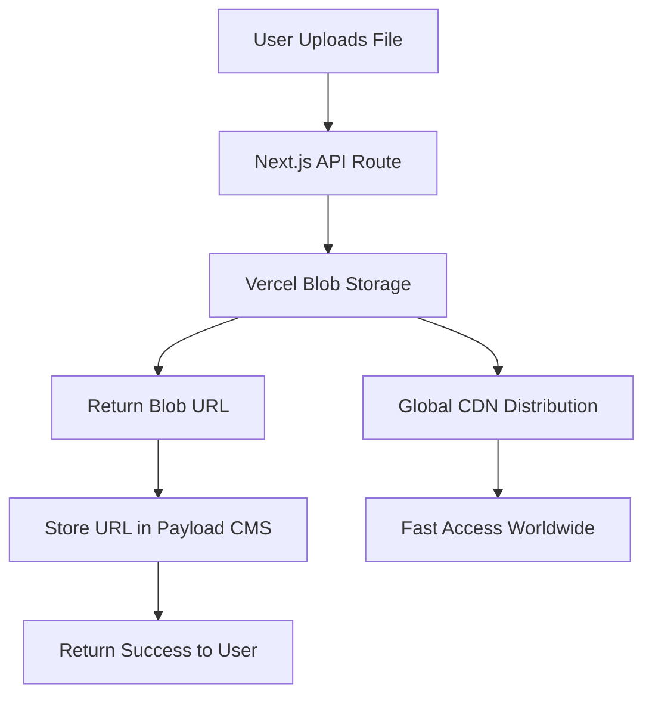
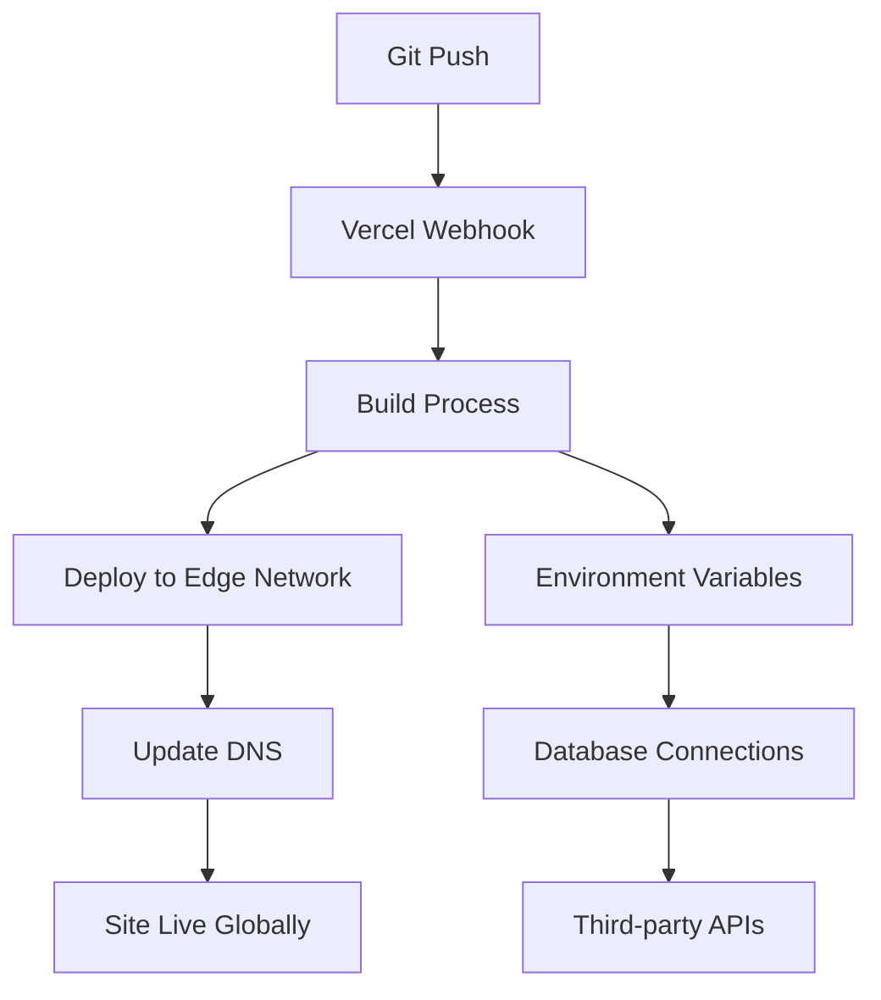

# 🚀 Vercel Platform Integration Guide

*Complete Hosting & Blob Storage Infrastructure Documentation*

## 📊 Overview

Vercel provides our hosting infrastructure and blob storage, offering seamless deployment with global CDN, serverless functions, and integrated storage solutions.

## 🏗️ **What Goes In vs What Goes Out**

### **INPUT (What We Send to Vercel):**
```typescript
// Deployment Payload
interface VercelDeployment {
  // Source Code
  files: {
    [path: string]: {
      content: string | Buffer
      encoding?: 'utf8' | 'base64'
    }
  }

  // Configuration
  vercel: {
    version: 2
    builds: Array<{
      src: string
      use: string
      config?: Record<string, any>
    }>
    routes: Array<{
      src: string
      dest: string
      headers?: Record<string, string>
    }>
  }

  // Environment Variables
  environment: {
    [key: string]: string
  }

  // Domain Configuration
  domains: string[]
}

// Blob Storage Upload
interface BlobUpload {
  pathname: string        // File path/name
  body: ReadableStream   // File content stream
  options: {
    access: 'public' | 'private'
    contentType?: string
    cacheControlMaxAge?: number
    metadata?: Record<string, string>
  }
}
```

### **OUTPUT (What Vercel Returns):**
```typescript
// Deployment Response
interface VercelDeploymentResponse {
  id: string                    // Deployment ID
  url: string                   // Preview URL
  name: string                  // Project name
  meta: {
    buildId: string
    commitSha?: string
    version: number
  }
  readyState: 'QUEUED' | 'BUILDING' | 'READY' | 'ERROR'
  createdAt: number            // Unix timestamp
  regions: string[]            // Deployed regions

  // Build Information
  builds: Array<{
    src: string
    use: string
    output: Array<{
      path: string
      size: number
      lambda?: {
        functionName: string
        layers: string[]
        memory: number
        timeout: number
      }
    }>
  }>
}

// Blob Storage Response
interface BlobResponse {
  url: string                  // Public access URL
  downloadUrl: string          // Direct download URL
  pathname: string             // Storage path
  size: number                 // File size in bytes
  uploadedAt: Date            // Upload timestamp
  contentType: string         // MIME type
  metadata?: Record<string, string>
}
```

## 🔌 **API Implementation**

### **Deployment API Usage**
```typescript
// src/services/VercelDeploymentService.ts

export class VercelDeploymentService {
  private vercelToken: string
  private teamId?: string

  constructor() {
    this.vercelToken = process.env.VERCEL_TOKEN!
    this.teamId = process.env.VERCEL_TEAM_ID
  }

  async deployProject(
    projectName: string,
    files: Record<string, string>,
    envVars?: Record<string, string>
  ): Promise<VercelDeploymentResponse> {
    const deployment: VercelDeployment = {
      files: this.prepareFiles(files),
      vercel: {
        version: 2,
        builds: [
          { src: 'package.json', use: '@vercel/next' }
        ],
        routes: [
          { src: '/(.*)', dest: '/$1' }
        ]
      },
      environment: envVars || {},
      domains: [`${projectName}.vercel.app`]
    }

    const response = await fetch('https://api.vercel.com/v13/deployments', {
      method: 'POST',
      headers: {
        'Authorization': `Bearer ${this.vercelToken}`,
        'Content-Type': 'application/json',
        ...(this.teamId && { 'X-Vercel-Team-Id': this.teamId })
      },
      body: JSON.stringify(deployment)
    })

    if (!response.ok) {
      throw new Error(`Deployment failed: ${response.status} ${response.statusText}`)
    }

    return response.json()
  }

  async getDeploymentStatus(deploymentId: string): Promise<{
    state: string
    readyState: string
    url?: string
    error?: string
  }> {
    const response = await fetch(`https://api.vercel.com/v13/deployments/${deploymentId}`, {
      headers: {
        'Authorization': `Bearer ${this.vercelToken}`,
        ...(this.teamId && { 'X-Vercel-Team-Id': this.teamId })
      }
    })

    return response.json()
  }

  private prepareFiles(files: Record<string, string>): Record<string, any> {
    const prepared: Record<string, any> = {}

    for (const [path, content] of Object.entries(files)) {
      prepared[path] = {
        content: content,
        encoding: 'utf8'
      }
    }

    return prepared
  }
}
```

### **Blob Storage Implementation**
```typescript
// src/services/VercelBlobService.ts

import { put, del, list, head, type PutBlobResult } from '@vercel/blob'

export class VercelBlobService {
  private blobReadWriteToken: string

  constructor() {
    this.blobReadWriteToken = process.env.BLOB_READ_WRITE_TOKEN!
  }

  async uploadFile(
    file: File | Buffer,
    pathname: string,
    options: {
      access?: 'public' | 'private'
      contentType?: string
      cacheControlMaxAge?: number
    } = {}
  ): Promise<BlobResponse> {
    try {
      const result: PutBlobResult = await put(pathname, file, {
        access: options.access || 'public',
        contentType: options.contentType,
        cacheControlMaxAge: options.cacheControlMaxAge || 3600,
        token: this.blobReadWriteToken
      })

      return {
        url: result.url,
        downloadUrl: result.downloadUrl,
        pathname: result.pathname,
        size: result.size,
        uploadedAt: new Date(),
        contentType: options.contentType || 'application/octet-stream'
      }
    } catch (error) {
      throw new Error(`Blob upload failed: ${error.message}`)
    }
  }

  async deleteFile(url: string): Promise<void> {
    try {
      await del(url, { token: this.blobReadWriteToken })
    } catch (error) {
      throw new Error(`Blob deletion failed: ${error.message}`)
    }
  }

  async listFiles(options?: {
    prefix?: string
    limit?: number
    cursor?: string
  }): Promise<{
    blobs: Array<{
      url: string
      pathname: string
      size: number
      uploadedAt: Date
    }>
    hasMore: boolean
    cursor?: string
  }> {
    try {
      const result = await list({
        prefix: options?.prefix,
        limit: options?.limit || 1000,
        cursor: options?.cursor,
        token: this.blobReadWriteToken
      })

      return {
        blobs: result.blobs.map(blob => ({
          url: blob.url,
          pathname: blob.pathname,
          size: blob.size,
          uploadedAt: blob.uploadedAt
        })),
        hasMore: result.hasMore,
        cursor: result.cursor
      }
    } catch (error) {
      throw new Error(`Blob listing failed: ${error.message}`)
    }
  }

  async getFileInfo(url: string): Promise<{
    size: number
    contentType: string
    cacheControl: string
  }> {
    try {
      const result = await head(url, { token: this.blobReadWriteToken })

      return {
        size: result.size,
        contentType: result.contentType,
        cacheControl: result.cacheControl
      }
    } catch (error) {
      throw new Error(`Blob head request failed: ${error.message}`)
    }
  }
}
```

## 🔧 **Environment Configuration**

### **Required Environment Variables**
```bash
# Vercel Deployment
VERCEL_TOKEN=vercel_token_here                    # API access token
VERCEL_TEAM_ID=team_xxxxxxxx                     # Team ID (optional)
VERCEL_PROJECT_ID=prj_xxxxxxxx                   # Project ID

# Blob Storage
BLOB_READ_WRITE_TOKEN=vercel_blob_token_here     # Blob storage token

# Vercel System Variables (Auto-provided)
VERCEL=1                                         # Indicates Vercel environment
VERCEL_ENV=production|preview|development        # Deployment environment
VERCEL_URL=your-deployment-url.vercel.app        # Deployment URL
VERCEL_REGION=iad1                              # Deployment region
```

### **Configuration Files**

#### **vercel.json**
```json
{
  "version": 2,
  "builds": [
    {
      "src": "package.json",
      "use": "@vercel/next"
    }
  ],
  "routes": [
    {
      "src": "/api/(.*)",
      "dest": "/api/$1"
    },
    {
      "src": "/(.*)",
      "dest": "/$1"
    }
  ],
  "env": {
    "DATABASE_URL": "@database-url",
    "NEXTAUTH_SECRET": "@nextauth-secret",
    "STRIPE_SECRET_KEY": "@stripe-secret"
  },
  "functions": {
    "src/app/api/**.ts": {
      "maxDuration": 30
    }
  },
  "crons": [
    {
      "path": "/api/revenue-analytics",
      "schedule": "0 2 * * *"
    }
  ]
}
```

## 📊 **Usage Patterns in Spaces Platform**

### **Media Upload Integration**
```typescript
// src/app/api/upload/route.ts

export async function POST(request: NextRequest) {
  const formData = await request.formData()
  const file = formData.get('file') as File

  if (!file) {
    return NextResponse.json({ error: 'No file provided' }, { status: 400 })
  }

  const blobService = new VercelBlobService()

  try {
    const result = await blobService.uploadFile(
      file,
      `uploads/${Date.now()}-${file.name}`,
      {
        access: 'public',
        contentType: file.type,
        cacheControlMaxAge: 86400 // 24 hours
      }
    )

    // Store in Payload CMS
    const payload = await getPayload({ config: configPromise })
    await payload.create({
      collection: 'media',
      data: {
        filename: file.name,
        url: result.url,
        mimeType: file.type,
        filesize: result.size,
        alt: `Uploaded ${file.name}`
      }
    })

    return NextResponse.json({
      success: true,
      url: result.url,
      size: result.size
    })
  } catch (error) {
    return NextResponse.json(
      { error: 'Upload failed', details: error.message },
      { status: 500 }
    )
  }
}
```

### **AI-Generated Content Storage**
```typescript
// Store AI-generated print-on-demand designs
export async function storeGeneratedDesign(
  tenantId: string,
  designData: Buffer,
  metadata: {
    productType: string
    prompt: string
    style: string
  }
): Promise<string> {
  const blobService = new VercelBlobService()

  const pathname = `ai-designs/${tenantId}/${Date.now()}-${metadata.productType}.png`

  const result = await blobService.uploadFile(
    designData,
    pathname,
    {
      access: 'public',
      contentType: 'image/png',
      cacheControlMaxAge: 31536000 // 1 year (immutable content)
    }
  )

  return result.url
}
```

## 🔄 **Data Flow Architecture**

### **File Upload Flow**


### **Deployment Flow**


## 💰 **Cost Optimization**

### **Current Vercel Pricing (as of 2024)**
| Resource | Free Tier | Pro Tier | Enterprise |
|----------|-----------|----------|------------|
| **Bandwidth** | 100GB/month | 1TB/month | Custom |
| **Build Minutes** | 6,000/month | 24,000/month | Custom |
| **Serverless Functions** | 100GB-hours | 1,000GB-hours | Custom |
| **Blob Storage** | 500MB | 100GB | Custom |
| **Edge Functions** | 500KB/deployment | 1MB/deployment | Custom |

### **Cost Comparison Analysis**
```typescript
// Alternative providers for cost comparison
interface HostingCostAnalysis {
  vercel: {
    convenience: 10    // Seamless Next.js integration
    performance: 9     // Global edge network
    cost: 6           // Premium pricing
    setup: 10         // Zero configuration
  }

  alternatives: {
    digitalOcean: {
      convenience: 6
      performance: 7
      cost: 9          // Much cheaper
      setup: 4         // Requires manual configuration
    }
    aws: {
      convenience: 4   // Complex setup
      performance: 10  // Best in class
      cost: 7          // Pay per use
      setup: 2         // Very complex
    }
    netlify: {
      convenience: 8   // Good DX
      performance: 8   // Good CDN
      cost: 7          // Competitive
      setup: 8         // Easy setup
    }
  }
}
```

## 🚨 **Error Handling & Monitoring**

### **Common Error Scenarios**
```typescript
export class VercelErrorHandler {
  static handleDeploymentError(error: any): string {
    if (error.code === 'FORBIDDEN') {
      return 'Invalid Vercel token or insufficient permissions'
    }
    if (error.code === 'RATE_LIMITED') {
      return 'API rate limit exceeded, retry in 60 seconds'
    }
    if (error.code === 'DEPLOYMENT_NOT_FOUND') {
      return 'Deployment not found or has been deleted'
    }
    return `Deployment error: ${error.message}`
  }

  static handleBlobError(error: any): string {
    if (error.code === 'blob_unknown') {
      return 'Blob not found'
    }
    if (error.code === 'store_suspended') {
      return 'Blob storage suspended due to billing issue'
    }
    if (error.code === 'forbidden') {
      return 'Invalid blob token or insufficient permissions'
    }
    return `Blob storage error: ${error.message}`
  }
}
```

## 📈 **Performance Optimization**

### **CDN Configuration**
```typescript
// Optimize cache headers for different content types
export const getCacheHeaders = (contentType: string): Record<string, string> => {
  const baseHeaders = {
    'X-Vercel-CDN-Cache-Control': 'public, max-age=31536000, immutable',
    'Cache-Control': 'public, max-age=31536000, immutable'
  }

  if (contentType.startsWith('image/')) {
    return {
      ...baseHeaders,
      'X-Vercel-CDN-Cache-Control': 'public, max-age=86400, s-maxage=31536000'
    }
  }

  if (contentType.includes('javascript') || contentType.includes('css')) {
    return {
      ...baseHeaders,
      'X-Vercel-CDN-Cache-Control': 'public, max-age=31536000, immutable'
    }
  }

  return {
    'Cache-Control': 'public, max-age=3600',
    'X-Vercel-CDN-Cache-Control': 'public, max-age=86400'
  }
}
```

## 🔧 **Implementation Status**

### ✅ **Currently Working:**
- Next.js application hosting
- Automatic deployments from Git
- Environment variable management
- Basic blob storage usage
- Global CDN distribution

### 🔄 **Needs Implementation:**
- Dedicated blob service integration
- AI-generated content storage workflow
- Cost monitoring and optimization
- Multi-region deployment strategy
- Backup and disaster recovery

---

*This integration provides the foundation for our entire platform infrastructure with global performance and seamless scaling.*
